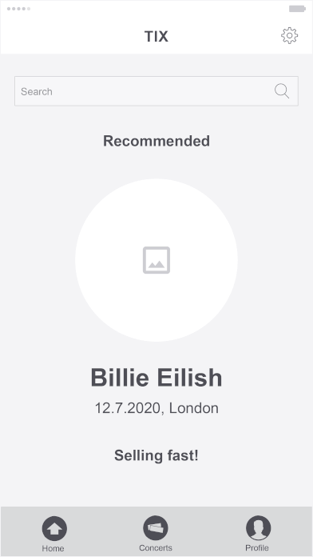

# UX Theory

You are working as a junior UX designer for a company that sells concert tickets. A product manager has asked you for your opinion of a low-fidelity wireframe for a new mobile app. Study this wireframe for the app's home screen and think about how it relates to the user story below.

\
\

\
The user story behind the mockup is:

**A.** The user wants to be able to see an overview of available concerts.  
**B.** The user wants to be able to see how close a concert is to selling out of tickets.  
**C.** The user wants to be able to buy tickets.  
**D.** The user wants to be able to quickly access more details about each concert.  
**E.** The user wants to discover concerts based on genre, location, or month.

For each element of the user story above, what needs to be changed in the design?

---

**A:** In relation to the scenario, this image is supposed to represent the home-screen of the concert tickets app. From what I can see, the home-screen is supposed to display a general overview with personal recommendations and the most popular upcoming concerts. In order to see a more comprehensive list of events, I presume they would be in the 'Concerts' menu. While I don't see anything inherently wrong with the flow, I think the screen should be redesigned to display several different events and not just one. Those elements being displayed so prominently on the home screen is a bit obnoxious and obtrusive. It would be fine for a specific concert page but the home-screen should provide a general overview of several different concerts that the user can click on.

The search bar and button layout is fine. The overview should display several different concerts and not focus so much on one big event. I presume that there will be some form of scrolling to see more listed items.

---

**B:** In the display for the Billie Eilish concert, there is a subtitle with the text "Selling fast!". This is fine for what it is, and can convey the concert's popularity and perhaps a sense of urgency to buy a ticket. However, it does not explicitly state how close the concert is to 'selling out', how many tickets are left, etc.

If the concert is "selling fast" but still has many tickets available, a general indication would be fine. If there are few tickets available, displaying an exact number would make sense. In referring to the overview page, it should not go into too much detail or provide too much information at once. It should be simple while getting the point across. You may choose to go into further detail on the specific event page.

In answering this question, I am assuming that there will be no 'dark patterns'. If you know, you know.

---

**C:** The transaction for buying tickets should take place on a separate form screen on the app where users enter their card details and other personal information. It should not all be done specifically on the home-screen. The event page should definitely have a "Buy ticket" button, but it is also worth considering adding a shortcut button to buy a ticket while searching, viewing recommendations, etc.

---

**D:** This is fine. The home-screen contains essential information about the concert such as the artist name, date, location, and a picture. If any of this catches the user's attention, they can tap on the artist name and view the page for that event.

---

**E:** The home-screen does contain a search bar, so that is a step in the right direction. While the search bar is good for keywords, I do not see any filters for genre, location, etc. I think that it would be best to have a simple search function on the home-screen while having more detailed filters in the search results, or perhaps in a dedicated 'Advanced Search' feature.
